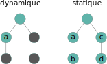

% Vers des véhicules autonomes sûrs avec clang-tidy
% David Wagner <<david.wagner@easymile.com>>, EasyMile 
% Capitole du Libre 2018

# C'est quoi un véhicule autonome sûr ?

- Problématiques
    - Tourne plusieurs heures
    - Beaucoup de code (métier et dépendances)
    - C++ est *difficile* et plein de pièges

. . .

- Moyens
    - **Options de compilation**
    - Tests unitaires
    - Tests d'intégration
    - **Analyse statique**
    - Analyse dynamique (valgrind, sanitizers)
    - Processus de développement

# Différence dynamique/statique

```{.cpp}
if (cond) {
  a();
  b();
} else {
  c();
  d();
}
```

Si **`cond == true`** et **`a`** contient une erreur fatale:



# Types d'analyses fournies par clang-tidy

- Plusieurs classes d'avertissements:
    - erreurs de programmation
    - recommandations du groupe isocpp
    - performance
    - modernisation
    - style/lisibilité

. . .

- Deux méthodes d'analyse:
    - Linter
    - Exécution symbolique du code (*clang-analyzer*)

# Autant d'erreurs dans un si petit code...

```{.cpp}
struct A {
  int first;
};

int main() {
  A* a = new A;
  int foo = a->first + 1;
  return a->first;
}
```
. . .
```
test.cpp:6:3: warning: use auto when initializing with new to avoid duplicating the type name [modernize-use-auto]
  A* a = new A;
  ^~
  auto
test.cpp:7:7: warning: Value stored to 'foo' during its initialization is never read [clang-analyzer-deadcode.DeadStores]
  int foo = a->first + 1;
      ^
test.cpp:7:7: note: Value stored to 'foo' during its initialization is never read
test.cpp:8:3: warning: Potential leak of memory pointed to by 'a' [clang-analyzer-cplusplus.NewDeleteLeaks]
  return a->first;
  ^
test.cpp:6:10: note: Memory is allocated
  A* a = new A;
         ^
test.cpp:8:3: note: Potential leak of memory pointed to by 'a'
  return a->first;
  ^
```

# ...et clang-tidy en a raté une

```{.cpp}
struct A {
  int first;
};

int main() {
  A* a = new A;
  int foo = a->first + 1;
  return a->first;
}
```

D'après valgrind (selon options d'optimisation), `a->first` n'est pas initialisé:

```
==17672== Syscall param exit_group(status) contains uninitialised byte(s)
==17672==    at 0x57E6948: _Exit (in /usr/lib64/libc-2.26.so)
==17672==    by 0x575A27A: __run_exit_handlers (in /usr/lib64/libc-2.26.so)
==17672==    by 0x575A319: exit (in /usr/lib64/libc-2.26.so)
==17672==    by 0x5743FF0: (below main) (in /usr/lib64/libc-2.26.so)
```

# Une bonne gestion de la mémoire

<!---
Utilisation des nouveaux outils de gestion sûre de la mémoire
-->

Quelques *checkers* clang-tidy:

- `cppcoreguidelines-pro-type-member-init`
- `core.uninitialized.*` (clang-analyzer)
    - cf. diapo précédente
- `modernize-make-unique`, `modernize-make-shared`, `modernize-replace-auto-ptr`

```{.cpp}
auto ptr = std::unique_ptr(new Ptr(a, b, c)); // avant
auto ptr = std::make_unique<Ptr>(a, b, c);    // après
```

# Ownership et passage d'arguments

<!---
C++11 donne de nouveaux outils pour améliorer les performances tout en rendant le code plus lisible
mais ils ne sont pas sans danger
-->

Quelques *checkers* clang-tidy:

- `modernize-pass-by-value`
- `misc-use-after-move`
- `performance-unnecessary-value-param`

```{.cpp}
struct C {
  C(const std::string& s) : m_s(s) {}     // avant
  C(std::string s) : m_s(std::move(s)) {} // après (modernize-pass-by-value)
};

auto str = std::string("bonjour");
auto c = C(std::move(str));
std::cout << str; // erreur (misc-use-after-move)
```

```{.cpp}
void f(const std::string s) {} // erreur (performance-unnecessary-value-param)
```

# Méthodes virtuelles

<!--- Transition: La plupart de ce qu'on a vu jusque ici tient de la bonne hygiène de code.
L'héritage et les méthodes virtuelles sont un nid à bugs qui mérite bien une attention
particulière et des règles de code; par exemple n'utiliser l'héritage que pour exprimer une
relation "B est un A" -->

Quelques *checkers* clang-tidy:

- `hicpp-use-override`
- `optin.cplusplus.VirtualCall` (clang-analyzer)

```{.cpp}
struct C {
  C() {
    interface1(42); // erreur (optin.cplusplus.VirtualCall)
  }
  virtual int interface1(int) { ... }
  virtual int interface2(int) { ... }
};
struct D : C {
  virtual int interface1(int);  // avant
  int interface1(int) override; // après (hicpp-use-override)
  int iterface2(int) override; // erreur de compilation
};
```

# Performance

<!---
Transition: De manière générale, C++ moderne donne des moyens de calculer beaucoup de chose
statiquement plutôt que de s'appuyer sur un dispatch dynamique.
Cependant, un compilateur C/C++ ne peut pas tout optimiser (il n'en a parfois pas le droit);
certaines optims peuvent cependant être suggérées automatiquement
-->

Quelques *checkers* clang-tidy:

- `performance-inefficient-vector-operation`
- `performance-unnecessary-copy-initialization`

```{.cpp}
std::vector<int> entiers;
entiers.reserve(100); // après (performance-inefficient-vector-operation)
for (int i = 0; i < 500; ++i) {
  entiers.push_back(i);
}

std::string str("bonjour");
const std::string& f() {
  return str;
}
```

```{.cpp}
auto x = f(); // avant
const auto& x = f(); // après (performance-unnecessary-copy-initialization)
std::cout << copie.size() << "\n";
```

# Faux positifs

- clang-tidy et clang-analyzer ont souvent raison et vous avez tort
- Si avoir tort vous embête, prétendez le contraire avec:
    - `int ri(char* d); // NOLINT(readability-non-const-parameter)`

. . .

```{.cpp}
explicit ThrottleContext(std::chrono::time_point<std::chrono::steady_clock> t) :
  last_log_time_point{t},
  count_hidden{0}
{}
```

# Adoption par les développ⋅eurs⋅euses

- Le bon:
    - Didactique
    - Paramétrable
    - Application automatique des suggestions ("fix-it"s)
    - Homogénéisation du code
    - Intégrations avec les éditeurs

. . .

- Le moins bon:
    - Analyse coûteuse en temps
        - environ 2~10 fois plus lent
    - Quelques faux positifs
    - Vrais positifs non reconnus ou perçus comme intrusifs

# Intégration CMake

- Support intégré (via `CMAKE_<LANG>_CLANG_TIDY`)
- Analyse incrémentale
- Évite de faire rentrer du code avec des erreurs
- L'intégration en CI réduit l'impact sur le développeur
- Possible d'ignorer les erreurs dans les dépendances externes ou les fichiers générés
    - `target_include_directories(SYSTEM)`, `set_source_file_properties`

# clang-tidy n'est pas la réponse à tout

- Faux négatifs
- Dépendances externes non analysées
    - sauf bibliothèques *header-only*
- Ensemble des *checkers* non exhaustif
- Certaines librairies ont leurs propres bonnes pratiques
    - pour Qt: <https://github.com/KDE/clazy>
- Pour aller plus loin: preuve formelle de l'absence de classes de bugs
    - Sans faux négatif
    - e.g. FramaC (ne supporte pas encore le C++)

# Résultat

- Pas d'erreur mémoire en prod.
- Confiance augmentée dans le code.

# Liens

- clang-tidy: <https://clang.llvm.org/extra/clang-tidy/>
- clang-analyzer: <https://clang-analyzer.llvm.org/available_checks.html>
- EasyMile: <http://www.easymile.com/>
